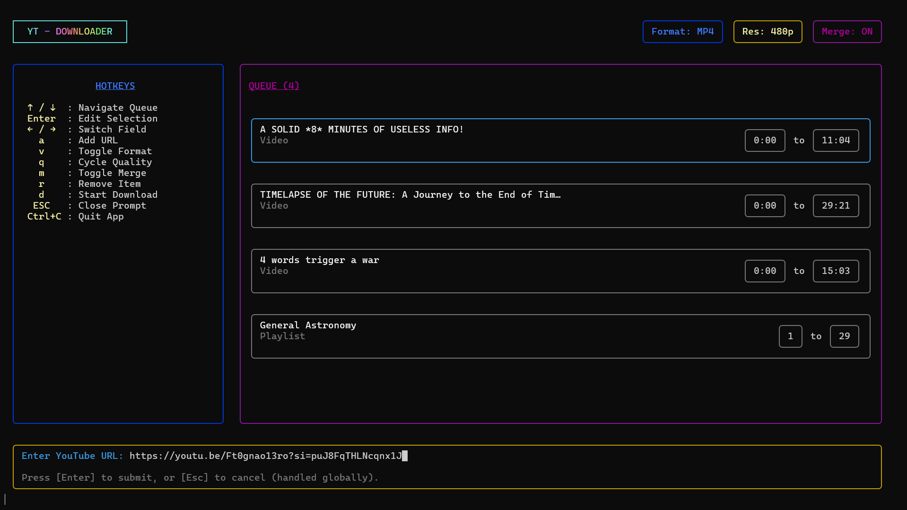

# Mux-YT

[](https://www.npmjs.com/package/mux-yt)
[](https://www.npmjs.com/package/mux-yt)
[](https://github.com/Shreyash0712/Mux-YT/blob/main/package.json)

The idea was simple: I was tired of going to website with sketchy ads and redirects just to download a YouTube video, and sometimes you just have to download a snippet from a video and downloading it whole and snipping it is just a pain. I also like to merge a playlist into a single video for watching - I couldn't find a tool that did all that together - so I made one.

## Screenshot



## Usage

You don't need to clone the repository or install media tools manually. As long as you have [Node.js](https://nodejs.org/) (v18+) (check version using `node --version` in your terminal), just run:

```bash
npx mux-yt
```

The app will launch instantly in your terminal!

> **Note:** Mux-YT requires [yt-dlp](https://github.com/yt-dlp/yt-dlp#installation) and [FFmpeg](https://ffmpeg.org/download.html). You can install them or let the app automatically download and configure them for you on first launch across all supported platforms (it may take a bit more time than usual on first run):
> (This auto dependency configuration feature is still very new (introduced in v2) - even though I have checked and it seems to be working, please let me know if you face any issues)
> - **Windows** (`x64`, `arm64`, `x86`)
> - **macOS** (`Apple Silicon` & `Intel`)
> - **Linux** (`x64`, `arm64`, `arm`)

However, if you're a dev or just like to fiddle with code, you can clone the repository and run the app locally:

```bash
git clone https://github.com/Shreyash0712/Mux-YT.git
cd Mux-YT
pnpm install
pnpm dev
```
## Features

- **Media Agnostic Queue**: Mix and match single YouTube videos and entire playlists in the same queue.
- **Precision Trimming**: Skip downloading full videos. Set start/end timestamps (e.g., `01:15` to `03:30`) and extract only what you need.
- **Playlist Segmenting**: Download specific segments of a playlist (e.g., Videos `1` to `5`) without grabbing the whole thing.
- **Auto-Merge Mode**: Seamlessly stitch your entire queue (videos + trimmed segments) into a single, contiguous output file using `ffmpeg` without re-encoding!
- **Format & Quality Control**: Globally toggle between Video (MP4) and Audio (MP3) formats, and easily cycle through max resolution targets (1080p, 720p, etc).
